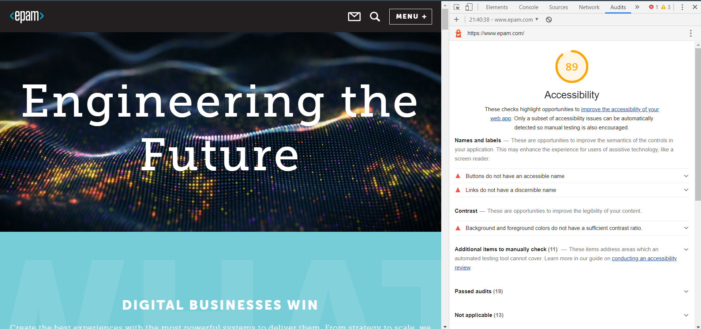
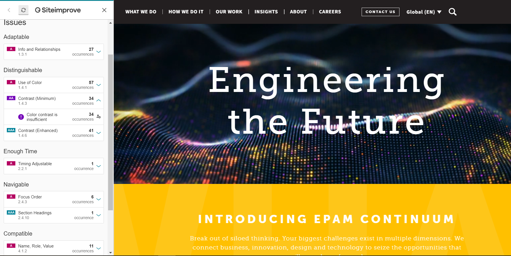
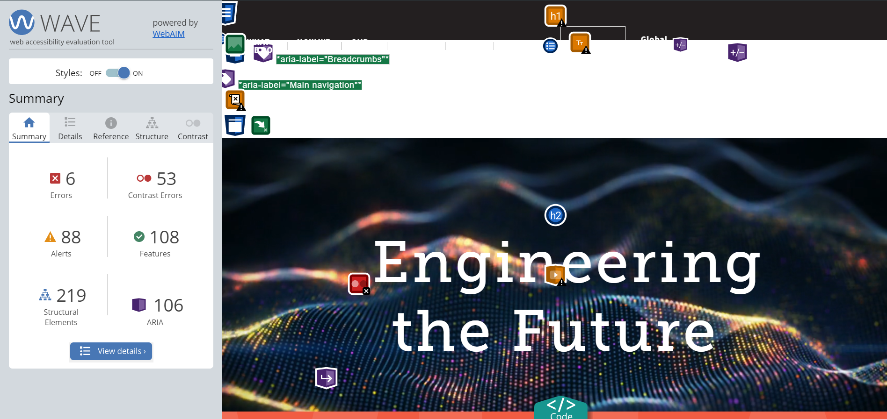
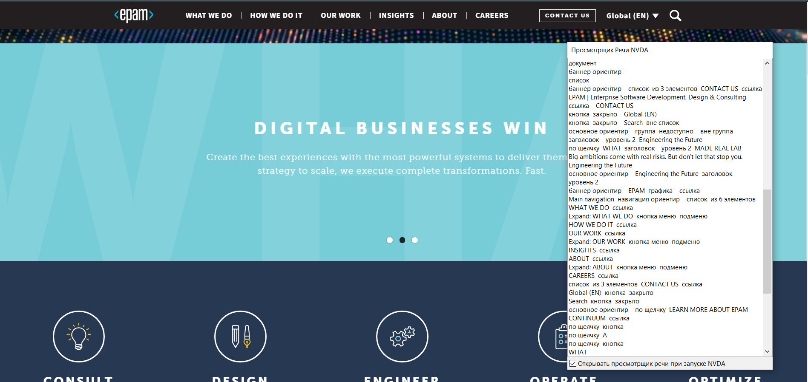
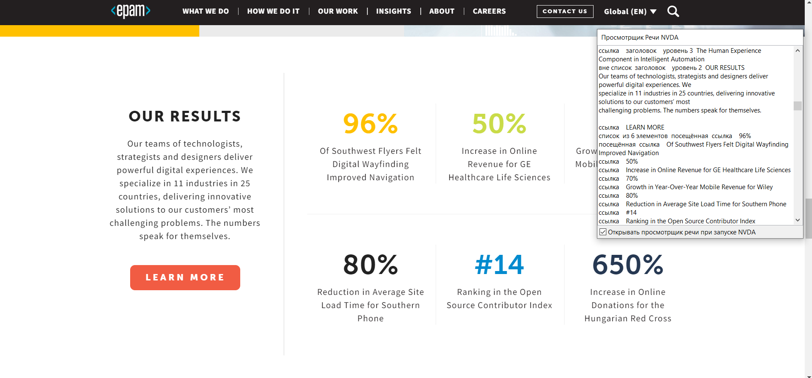
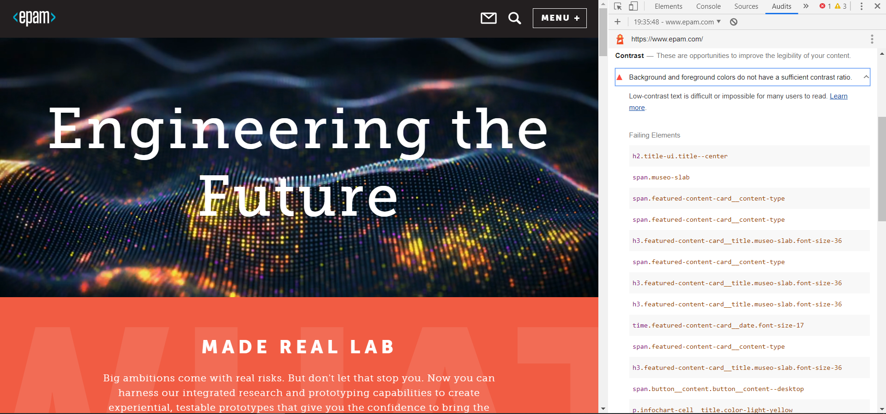
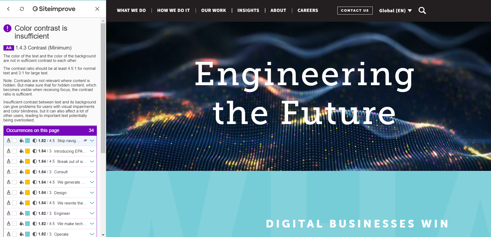
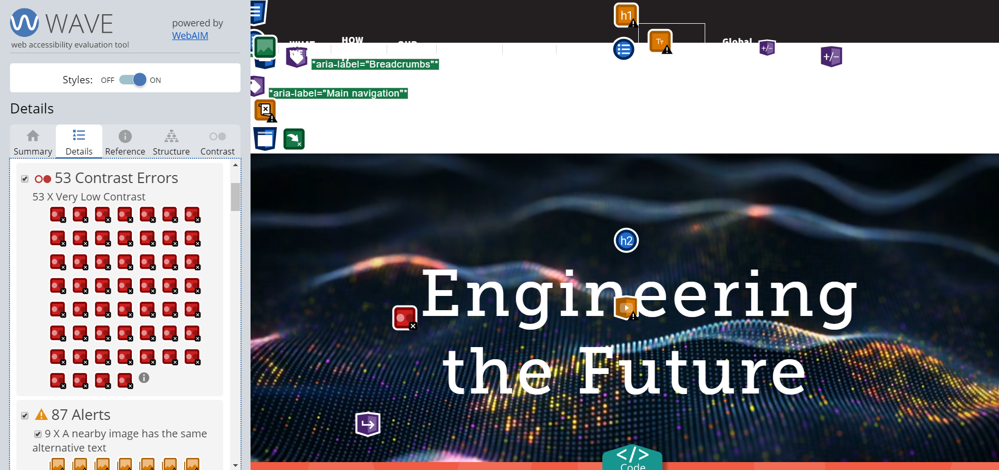

# Accessibility testing tools home task #1

[1. Работа с Audit tools](#1-работа-с-audit-tools)

[2. Работа с NVDA](#2-работа-с-nvda)

[3. Работа с контрастностью](#3-работа-с-контрастностью)

## 1. Работа с Audit tools

### a. Результаты аудита в Google Chrome dev tools Accessibility Audit страницы https://www.epam.com/ (Desktop version).

### b-c. Аудит страницы в Siteimprove plugin  

#### Список найденных ошибок:
* (А) 1.3.1 Info and Relationships. The 'bold' tag is used to highlight text.
* (А) 1.4.1 Use of Color
  It appears that color is the only distinguishing feature about links in blocks of text. 
  (Номера телефонов подчеркиваются как ссылки только при ховере)
* (АА) 1.4.3 Contrast (Minimum).
   The color of the text and the color of the background are not in sufficient contrast to each other.
*  (ААА) 1.4.6 Contrast (Enhanced).
  The color of the text and the color of the background are not in sufficient contrast to each other.
* (А) 4.1.2 Name, Role, Value. Missing required WAI-ARIA states or properties.
 
 ###### Ошибочно найденные критерии:
 * The 'bold' tag is used to highlight text. Если нам нужно подчеркнуть важность написанного, нужно было бы использовать 'strong'. 
 Но в данном случае bold используется только для указания стилей.
 
 
### d-e. Аудит страницы в Wave plugin  

#### Список найденных ошибок:

* 1 X Empty heading
* 3 X Empty button
* 2 X Empty link
* 53 Contrast Errors

###### Ошибочно найденные критерии:
* Empty heading. Заголовок h5 с классом locations-viewer__office-name подгружается динамически. 
* Пустые ссылки с классом top-navigation__main-link ведут на несуществующую страницу  https://www.epam.com/our-work/healthcare

## 2. Работа с NVDA

Навигация по кнопкам (карусель) не информативна. 
Нарушены 1.1.1 Non-text Content (Level A) и 2.4.4 Link Purpose (In Context) (Level A)

Название ссылок не понятно (проценты, цифры).

Нарушен 2.4.4 Link Purpose (In Context)

## 3. Работа с контрастностью
Success criteria: 

* 1.4.6 Contrast (Enhanced)
* 1.4.11 Non-text Contrast

##### Google Chrome dev tools Accessibility Audit

Background and foreground colors do not have a sufficient contrast ratio.
Low-contrast text is difficult or impossible for many users to read.

Failing Elements:
<pre>
h2.title-ui.title--center
span.museo-slab
span.featured-content-card__content-type
span.featured-content-card__content-type
h3.featured-content-card__title.museo-slab.font-size-36
span.featured-content-card__content-type
h3.featured-content-card__title.museo-slab.font-size-36
h3.featured-content-card__title.museo-slab.font-size-36
time.featured-content-card__date.font-size-17
span.featured-content-card__content-type
h3.featured-content-card__title.museo-slab.font-size-36
span.button__content.button__content--desktop
p.infochart-cell__title.color-light-yellow
p.infochart-cell__title.color-light-green
span.font-size-31
a
h2.title-ui.title--center
span.font-size-17
span.button__content.button__content--desktop
div.locations-viewer__country-title
div.locations-viewer__country-title
div.locations-viewer__country-title
</pre>

##### Siteimprove plugin

G18 Ensuring that a contrast ratio of at least 4.5:1 exists between text (and images of text) and background behind the text

##### Wave plugin

1.4.3 Contrast (Minimum) (Level AA)